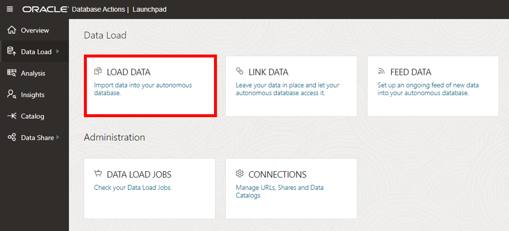
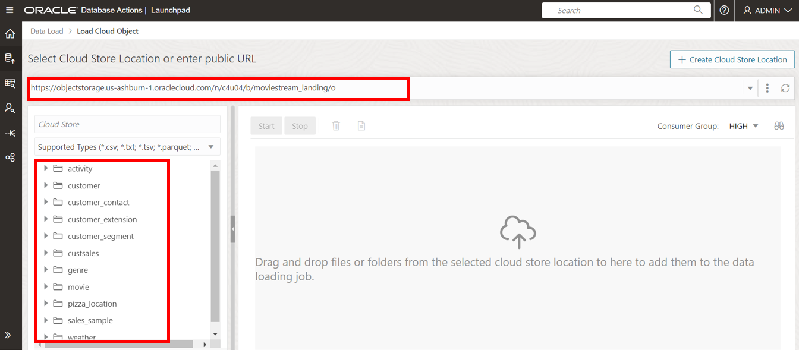
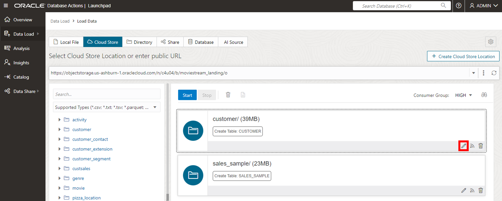
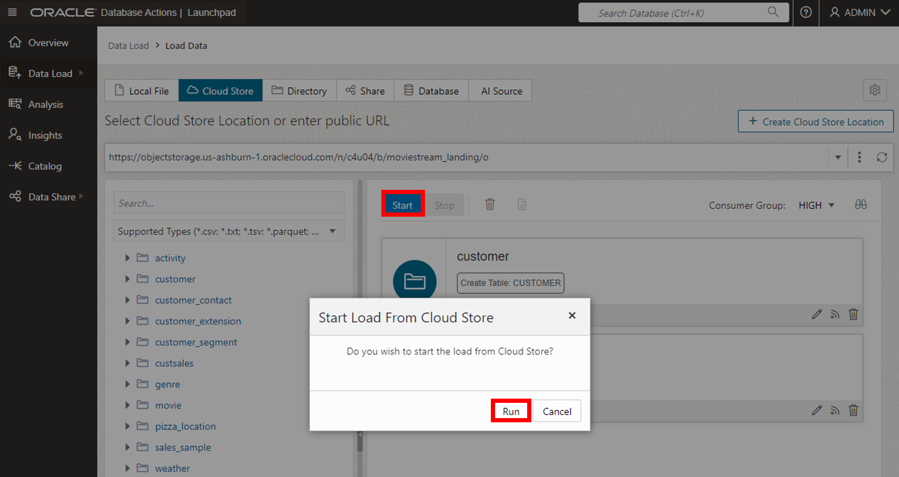
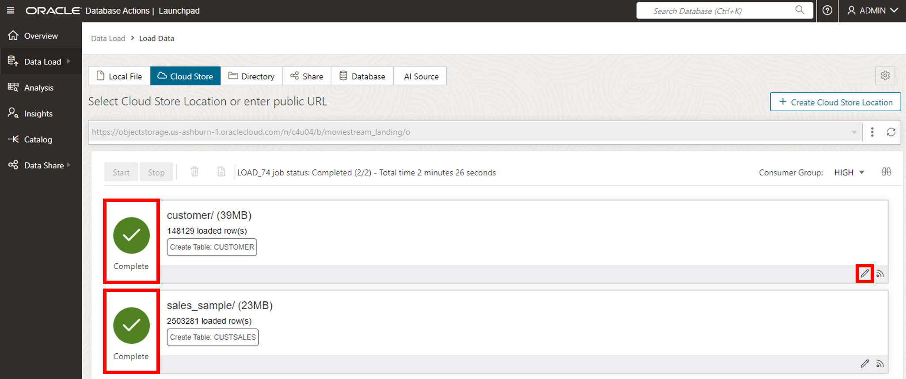
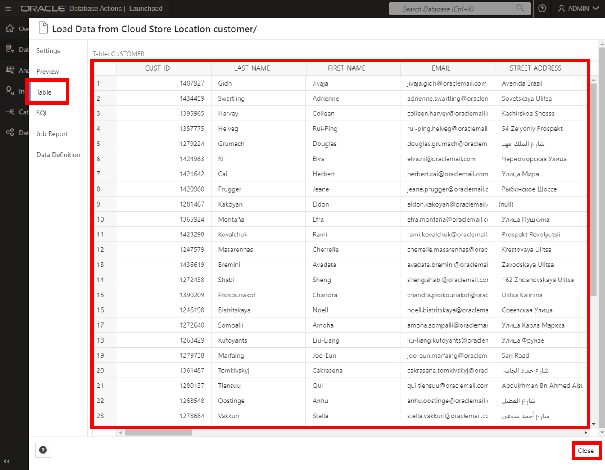

<!--
    {
        "name":"Load data from public buckets using Database Actions",
        "description":"Uses Database Actions to load data from public object storage buckets. It loads the following two tables:<ul><li>customer</li><li>sales_sample</li></ul>"
    }
-->
1. Under **Data Load** select **LOAD DATA**.

    

2. The **Load Cloud Object** page appears. Use this page to drag and drop tables from the public object storage bucket to the data loading job. Click **Cloud Store** and copy the following object storage URL to the **Select Cloud Store Location or enter public URL field**:

    ```
    <copy>
    https://objectstorage.us-ashburn-1.oraclecloud.com/n/c4u04/b/moviestream_landing/o
    </copy>
    ```

    Click ENTER on your keyboard. You will see a list of folders on the left side from which you can drag and drop to the data loading job.

    

    

3. You will select multiple folders. First, drag the **customer** folder over to the right hand pane. Note that a dialog box appears asking if you want to load all the files in this folder to a single target table. In this case, the folder has only a single file, `customer.csv`. Frequently, data lake folders contain many files of the same type, as you will see with sales data. Click **Yes**.

    

4. Perform the same drag and drop steps for **sales\_sample**.

5. Click the pencil icon for the **customer** load task to view the settings for this task.

    

6. In the settings viewer, you can see that Database Actions will create a **CUSTOMER** table with the list of columns and data types that will be created from the csv file. They all look correct, so click **Close** to close the settings viewer.

    

7. Click the pencil icon for the **sales\_sample** task to view its settings. In this case, update the name of the table to **CUSTSALES**.

    

    Click **Close**.

8. Now click the **Start** button to run the data load job. In the pop-up dialog, click **Run**.

    

    The job should take about 2 minutes to run.

9. Check that the two data load cards have green tick marks in them, indicating that the data load tasks have completed successfully. Click the 3-dot ellipsis icon on the far-right side of the **customer** block. Click the **Settings** pencil icon for the **customer** load task:

    

10. Let's do a quick review of the loaded data. Click the **Table** tab to view the **customer** data:

    

    The data looks good! Click **Close** to exit the **customer** load task and then click **Done** to exit the DATA LOAD tool and return to the Database Actions Launchpad.
